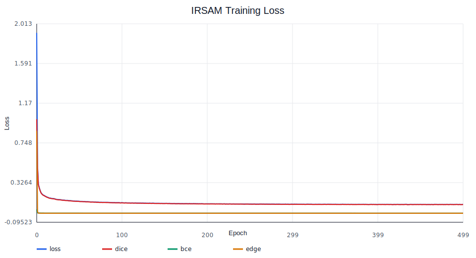
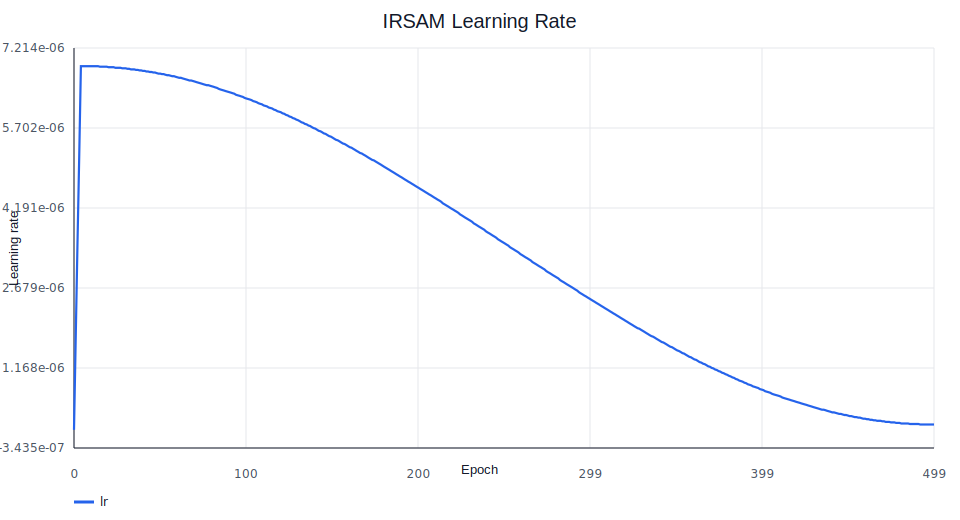
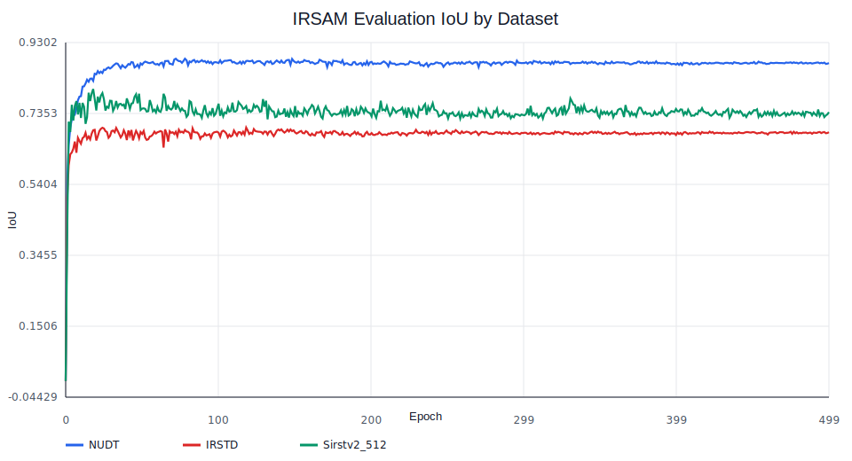

# IRSAM Reproduction

This repository is set up to reproduce IRSAM training and evaluation. The training configuration in
`train_IRSAM.py` follows the hyperparameters reported in the paper.

Even though I save best metrics seperately I could not match any of the described metric in the paper. 

## Repository Layout

```text
.
|-- datasets/
|-- segment_anything_training/
|-- tools/
|   |-- trace_training_log.py
|-- utils/
|-- train_IRSAM.py
|-- demo.py
|-- prepare_datasets.py
`-- assets/reproduction/
```

## Datasets

`train_IRSAM.py` defines three evaluation datasets:

| Dataset option | Logged dataset name | Expected directory |
| --- | --- | --- |
| `NUDT` | `NUDT` | `datasets/NUDT-SIRST00` |
| `IRSTD` | `IRSTD` | `datasets/IRSTD-1k` |
| `Sirstv2` | `Sirstv2_512` | `datasets/Sirstv2_512` |

Use the split files supplied with each dataset and arrange images and masks into:

```text
datasets/<dataset>/trainval_images/
datasets/<dataset>/trainval_masks/
datasets/<dataset>/test_images/
datasets/<dataset>/test_masks/
```

The helper script can prepare the included dataset folders:

```bash
python3 prepare_datasets.py
```

## Training Configuration

The default reproduction hyperparameters are extracted from original paper:

| Setting | Value |
| --- | ---: |
| Optimizer | AdamW |
| Initial learning rate | `1e-4` |
| Weight decay | `0.01` |
| Epochs | `500` |
| Warmup epochs | `5` |
| LR schedule | Cosine annealing |
| Input size | `512 x 512` |
| Train batch size | `4` |
| Validation batch size | `1` by default, `4` in the logged run |
| Evaluation frequency | every `10` epochs by default, every `1` epoch in the logged run |
| Mask dice loss weight | `1.0` |
| Mask BCE loss weight | `1.0` |
| Edge BCE loss weight | `1.0` |
| Data augmentation | resize to `512 x 512`, random horizontal flip for training |

Example full training run:

```bash
python3 train_IRSAM.py \
  --output output/run_irsam_all \
  --checkpoint mobile_sam.pt \
  --dataset all \
  --batch_size_train 4 \
  --batch_size_valid 4 \
  --eval_fre 1
```

Evaluation-only run:

```bash
python3 train_IRSAM.py \
  --output output/eval_irsam \
  --checkpoint mobile_sam.pt \
  --dataset all \
  --eval
```

## Training Metrics







## Reproduction Results

The reproduction row reports the best observed IoU, nIoU, and PD for each dataset across the traced
training log. FA is reported as the minimum observed value because lower false alarm is better.

| Model | Source | Dataset | IoU ↑ | nIoU ↑ | PD ↑ | FA ↓ |
| --- | --- | --- | ---: | ---: | ---: | ---: |
| IRSAM | Paper | NUDT | 0.9259 | 0.9329 | 0.9887 | 0.00000694 |
| IRSAM | Reproduction | NUDT | 0.8859 (epoch 72) | 0.9061 (epoch 78) | 0.9944 (epoch 31) | 0.00000184 (epoch 10) |
| IRSAM | Paper | IRSTD | 0.7369 | 0.6897 | 96.92 | 0.00000755 |
| IRSAM | Reproduction | IRSTD | 0.6965 (epoch 118) | 0.6462 (epoch 65) | 0.9628 (epoch 292) | 0.00000681 (epoch 26) |
| IRSAM | Paper | Sirstv2_512 | 0.8078 | 0.7839 | 0.9953 | 0.00000395 |
| IRSAM | Reproduction | Sirstv2_512 | 0.8026 (epoch 18) | 0.8040 (epoch 18) | 1.0000 (epoch 15) | 0.00000529 (epoch 80) |
